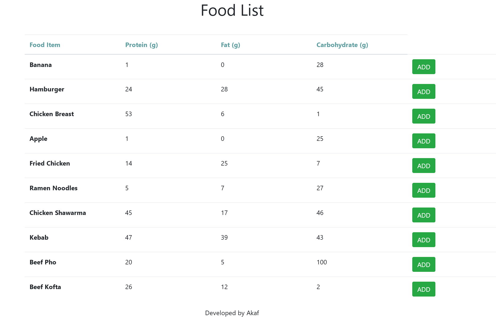

# foodWeb

foodWeb is a angular web app that allows the user to record what they eat to see their eating habits.

**Running**  
To run this anhular web app install the repo and use the `ng serve` command in the dictory using terminal. 

**Navgation**  
There is a navgation bar on the left side of the screen where user can navgate to different components of the app.
The four components are 'Food', 'Today', 'Chart', and 'Add to List'

**Food**  
In this component the user is given a list of foods that they can add

**Today**  
This componet displays what the user has added from the 'Food' component, and given the total macronutrient of the day.

**Chart**  
Displays a visual representation of the total macros of the day in a pie chart. Hovering over the pie chart shows the name and amount of the macronutrient. Allows users to disable certain macronutrients by clicking them in the legend on top.

**Add to List**  
User can add custom food with their macronutrients to the list in the 'Food' componet.

